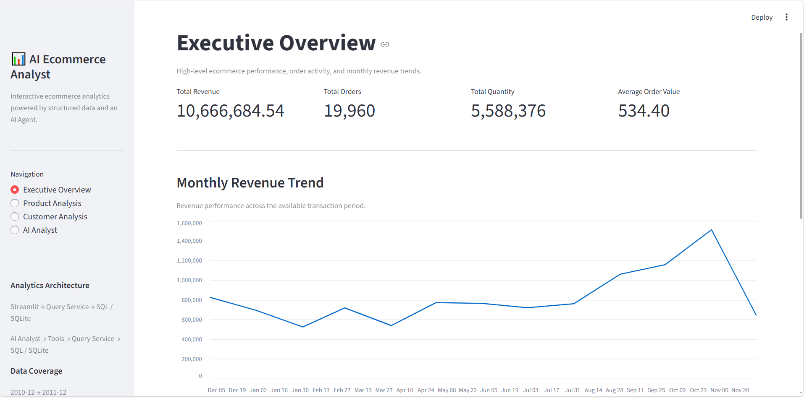
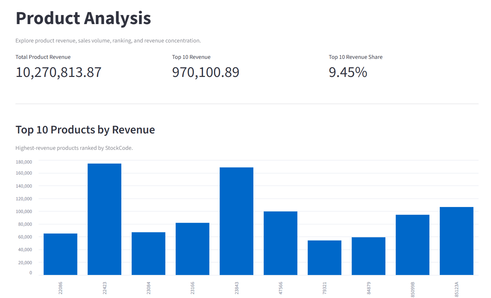
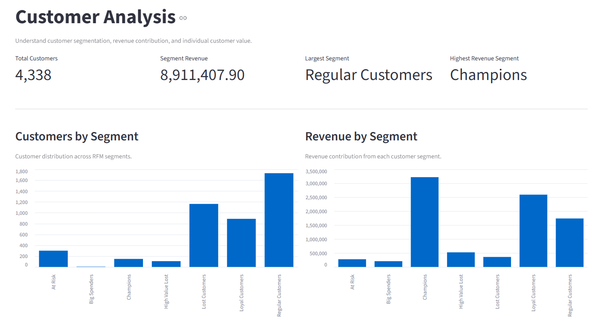
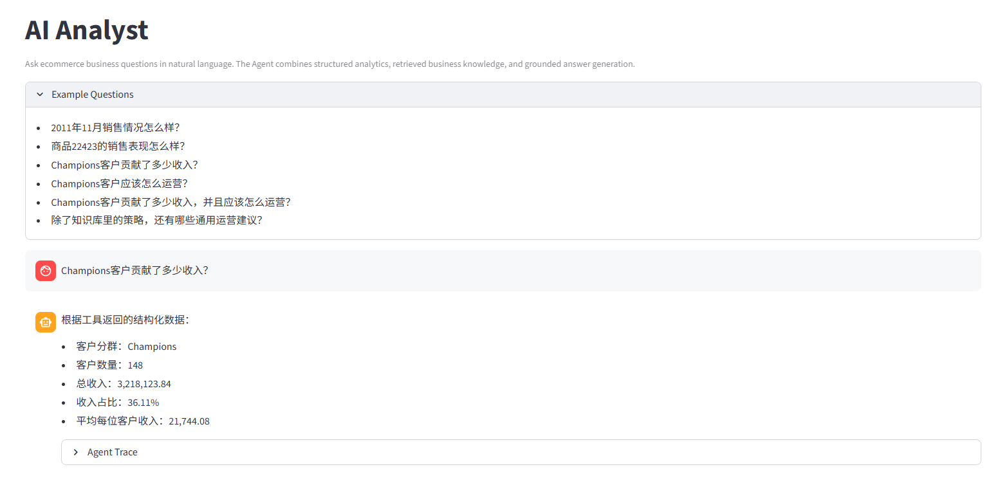
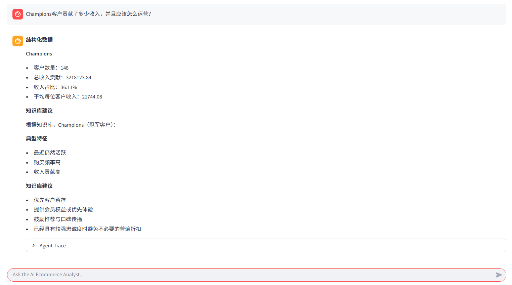
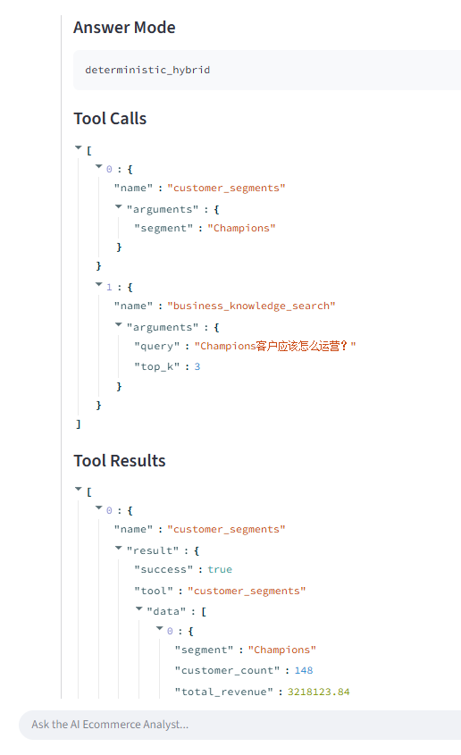

# E-commerce Sales Analyzer

# 中文说明

> 面向电商交易数据的人工智能分析项目，融合确定性数据分析、SQL 分析服务、大语言模型智能体、本地知识检索、来源可追踪的混合推理以及交互式数据仪表盘。

## 项目速览

**E-commerce Sales Analyzer** 是一个面向作品集展示的 人工智能电商分析系统，将交易数据转化为确定性业务指标、工具 驱动分析、检索增强生成 业务知识以及来源可追踪的自然语言回答。

项目没有让 大语言模型 直接承担业务计算，而是明确拆分职责：

```text
结构化数据
→ Pandas / SQL / 查询服务层
→ 确定性事实

业务知识
→ 本地 检索增强生成
→ 检索知识

大语言模型智能体
→ 意图理解 + 工具 选择 + 证据组合
```

> **核心设计原则：** 大语言模型 不直接查询 SQLite，也不作为业务指标的事实来源。

当前系统把 **Python、Pandas、SQLite、SQL 分析视图、大语言模型智能体、工具调用、本地 检索增强生成、事实依据校验、来源标注 控制和 Streamlit** 串成一套完整工作流。

---

## 为什么这个项目值得展示

很多“人工智能与数据分析”演示 会让模型在同一个概率性步骤里生成 SQL、计算指标并解释结果。本项目有意将这些职责拆开。

系统明确支持四类问题：

| 问题类型 | 示例 | 证据路径 |
| --- | --- | --- |
| 结构化事实 | `Champions客户贡献了多少收入？` | 结构化分析工具 → 查询服务层 → SQL |
| 业务知识 | `Champions客户应该怎么运营？` | 检索增强生成 → 筛选后的知识 → 确定性渲染器 |
| 混合问答 | `Champions客户贡献了多少收入，并且应该怎么运营？` | 结构化分析工具 + 检索增强生成 → 确定性组合 |
| 通用建议 | `除了知识库，还有哪些通用运营建议？` | 模型通用知识 → 显式“非知识库内容” 来源标注 |

因此，这个项目的重点不只是“和数据聊天”，而是：

> **不同类型的信息应该从哪里来，以及如何避免它们互相冒充。**

---

## 核心架构

```text
用户
│
├── 交互式数据仪表盘
│   └── 查询服务层
│       └── SQL / 分析视图
│           └── SQLite
│
└── 智能分析助手
    └── 大语言模型智能体
        ├── 结构化分析工具
        │   └── 查询服务层
        │       └── SQL / 分析视图
        │           └── SQLite
        │
        └── business_knowledge_search
            └── 知识检索器
                └── 本地向量存储
                    └── 双语知识库
```

结构化数据访问链路固定为：

```text
用户
→ 大语言模型 / 智能体
→ 工具
→ 查询服务层
→ SQL / 视图
→ SQLite
```

智能体 不能绕过 工具层 和 查询服务层 直接访问数据库。

### 系统架构图

<p align="center">
  <a href="docs/images/system_architecture_cn.svg">
  
  </a>
</p>

<p align="center"><em>图 1｜系统端到端架构：Streamlit 前端、Agent 编排、结构化分析工具、RAG 知识增强、Query Service、SQL 分析视图与 SQLite 数据层。</em></p>

---

## 工程亮点

### 1. 先确定性计算，再由大语言模型解释

收入、订单量、销量、平均订单价值、商品分析、客户分析、RFM、趋势和比较指标均由 Pandas / Python / SQL 计算，而不是让模型现场算数。

### 2. 工具驱动的智能体架构

大语言模型 通过注册好的分析 工具 获取事实，不直接访问数据库。工具路由器 与 查询服务层 让数据访问路径明确、可测试。

### 3. 高级趋势与比较语义

月份、商品和客户分群比较会返回差值、差异百分比、方向、幅度、月份完整性和指标级胜者等结构化字段。

### 4. 结构化数据与检索增强生成混合架构

结构化事实继续来自分析 工具；业务定义、解释框架和运营知识可以来自本地中英双语知识库。

### 5. 来源可追踪的回答生成

支持的客户分群 检索增强生成 使用确定性 知识条目、筛选器 和 渲染器。混合问答 场景可以确定性组合结构化事实与检索知识。

用户明确请求的模型通用建议会单独标注为“非知识库内容”。

### 6. 轻量事实依据校验

事实依据校验 会检查 工具 执行、无依据数字、无依据币种、知识检索证据可用性 和 检索来源对齐，同时避免引入第二个 大语言模型 Judge。

### 7. 可观察的交互式智能体

智能分析助手 页面会展示：

```text
回答模式
工具调用记录
工具返回结果
事实依据校验
知识来源
```

因此 智能体 的执行过程可检查，而不是黑盒。

---

## 演示主线

最终演示只需要四个问题：

```text
1. Champions客户贡献了多少收入？
   → 仅结构化数据

2. Champions客户应该怎么运营？
   → 仅知识检索 / deterministic_rag

3. Champions客户贡献了多少收入，并且应该怎么运营？
   → 混合问答 / deterministic_hybrid

4. 商品22423和85123A相比，哪个收入更高，哪个销量更高？
   → Advanced Structured Comparison
```

这四问可以一次展示确定性分析、检索增强生成、混合问答、来源标注 和比较能力。

### Streamlit 分析界面

#### 执行概览

<p align="center">
  <a href="docs/images/overview.png">
  
  </a>
</p>

<p align="center"><em>图 2｜执行概览：核心销售指标与月度收入趋势。</em></p>

#### 商品分析

<p align="center">
  <a href="docs/images/product_analysis.png">
  
  </a>
</p>

<p align="center"><em>图 3｜商品分析：商品收入、Top 10 收入贡献与收入集中度。</em></p>

#### 客户分析

<p align="center">
  <a href="docs/images/customer_analysis.png">
  
  </a>
</p>

<p align="center"><em>图 4｜客户分析：RFM 客户分群、客户数量分布与分群收入贡献。</em></p>

### AI Analyst 演示

#### 结构化事实问答

<p align="center">
  <a href="docs/images/ai_structured.png">
  
  </a>
</p>

<p align="center"><em>图 5｜结构化事实问答：Agent 调用客户分群工具，并基于结构化结果返回确定性事实。</em></p>

#### 结构化数据 + RAG 混合问答

<p align="center">
  <a href="docs/images/ai_hybrid.png">
  
  </a>
</p>

<p align="center"><em>图 6｜混合问答：同一问题中组合客户分群结构化数据与知识库运营建议。</em></p>

#### Agent 执行轨迹

<p align="center">
  <a href="docs/images/ai_trace.png">
  
  </a>
</p>

<p align="center"><em>图 7｜Agent 执行轨迹：展示 deterministic_hybrid 回答模式，以及 customer_segments 与 business_knowledge_search 两类工具调用。</em></p>

---

## 技术栈

```text
数据与分析
Python · Pandas · NumPy · SQLite · SQL

大语言模型与智能体
SiliconFlow · Qwen/Qwen3-8B · 兼容 Open人工智能 协议的接口 · 工具调用

检索增强生成
Qwen/Qwen3-Embedding-0.6B · NumPy 余弦相似度 · JSON 格式本地索引

应用
Streamlit

工程设计
模型服务抽象层 · 查询服务层 · 工具注册表 · 工具路由器
事实依据校验器 · 回归测试 · Git
```

---

## 项目进度

```text
阶段 1 — 数据分析与查询层
✅ 已完成

阶段 2 — 大语言模型 智能体集成与基于事实的工具调度
✅ 已完成

阶段 3 — Streamlit 人工智能 电商分析仪表盘与交互分析
✅ 已完成

阶段 4 — 高级分析与业务推理
✅ 已完成

阶段 5 — 结构化数据与检索增强生成混合架构
✅ 已完成

阶段 6 — 作品集包装与演示
🟡 进行中
```

详细实现文档：

```text
docs/en/阶段4_Advanced_Analytics_EN.md
docs/en/阶段5_Structured_Data_检索增强生成_混合问答_EN.md
docs/zh/阶段4_Advanced_Analytics_CN.md
docs/zh/阶段5_Structured_Data_检索增强生成_混合问答_CN.md
```

---

## 当前分析能力

### 销售分析

- 整体销售收入
- 总订单数
- 总销售数量
- 平均订单价值
- 月度销售收入
- 月度订单量
- 月度收入增长率
- 收入最高月份
- 订单数最高月份
- 月度收入最大增长
- 月度收入最大下降
- 最新月份完整性识别

### 商品分析

- 商品收入
- 商品销量
- 商品订单数
- 商品排名
- 前 10 商品收入
- 前 10 商品收入集中度
- 基于 商品编码 的商品两两比较
- 收入 / 销量 / 订单数比较语义
- 指标级商品胜者

### 客户分析

- 客户订单数
- 客户总收入贡献
- 客户平均订单价值
- 首次购买日期
- 最近购买日期
- 最近购买时间、购买频率和消费金额（RFM）客户分群
- 分群客户数量
- 分群收入贡献
- 客户平均收入贡献
- 客户分群两两比较
- 收入占比百分点差异

### 比较分析

所有两两比较服务统一使用：

```text
difference = B - A
```

普通数值指标的差异百分比：

```text
percentage_difference = (B - A) / A × 100
```

当基准值 `A = 0` 时，差异百分比返回 `None`。

比较层同时提供：

```text
direction
magnitude
magnitude_pct
higher_xxx
```

等结构化字段，减少 大语言模型 自行重新计算确定性事实。

---

## 月份完整性规则

月度趋势排名只使用完整月份。

月度环比比较要求当前月份和前一个月份都完整。

数据集最新月份即使不完整仍然返回，但必须明确标记为部分月份。

当前数据覆盖范围：

```text
2010-12-01 08:26:00
→
2011-12-09 12:50:00
```

因此：

```text
2011-12
is_partial_month = True
```

部分月份仍然可以查询，但不能被解释为与完整月份完全可比。

---

## 当前智能体工具

当前核心 工具层 包括：

```text
sales_kpi
monthly_sales
monthly_trend_insights
month_comparison
customer_value
product_performance
product_comparison
product_concentration
customer_segments
segment_comparison
business_knowledge_search
```

智能体 的固定数据访问链路保持：

```text
用户
→ 大语言模型 / 智能体
→ 工具
→ 查询服务层
→ SQL / 视图
→ SQLite
```

智能体 不直接查询 SQLite。

---

## 智能分析助手

智能分析助手 支持用户使用自然语言提出电商业务问题。

示例问题：

```text
2011年11月销售情况怎么样？

哪个月销售收入最高？

2011-10和2011-11哪个月收入更高？

商品22423和85123A哪个收入更高？

Champions和Loyal Customers哪个收入贡献更高？

商品22423的销售表现怎么样？

Champions客户贡献了多少收入？

整体销售收入是多少，同时前 10商品占整体商品收入多少？
```

智能体 会根据问题在结构化分析 工具 与业务知识检索之间进行路由。确定性数据事实继续来自 查询服务层，而业务定义、解释框架与运营知识可以来自 检索增强生成。

阶段 5 支持：

```text
仅结构化数据
仅知识检索
混合问答
显式标注来源的模型通用建议
```

交互式页面同时展示：

```text
回答模式
工具调用记录
工具返回结果
事实依据校验
知识来源
```

因此 智能体 的执行过程是可观察的，而不是完全黑盒。

---

## 趋势洞察

`monthly_trend_insights` 提供确定性的月度趋势摘要。

已验证结果：

```text
销售收入最高月份：
2011-11
收入：1,509,496.33
订单数：2,769
收入环比：30.69%

收入增长最快月份：
2011-05
收入环比：43.27%

收入下降最明显月份：
2011-04
收入环比：-25.06%

数据集最新月份：
2011-12
收入：638,792.68
订单数：819
收入环比：-57.68%
is_partial_month: True
```

最新月份虽然可查询，但会明确标记为不完整月份。

---

## 比较分析能力

### 月份比较

`month_comparison` 比较两个明确月份的：

```text
revenue
orders
```

并返回：

```text
difference
percentage_difference
direction
magnitude
higher_xxx
partial_months
comparison_is_fully_comparable
```

示例：

```text
2011-10 → 2011-11

收入差值：+354,517.03
收入差异百分比：+30.69%

订单差值：+729
订单差异百分比：+35.74%
```

### 商品比较

`product_comparison` 比较两个 商品编码 的：

```text
revenue
quantity
orders
```

示例：

```text
22423 vs 85123A

收入更高：
22423

销量更高：
85123A

订单数更多：
85123A
```

商品编码 是商品唯一键，商品描述 只作为展示字段。

### 客户分群比较

`segment_comparison` 比较两个客户分群的：

```text
customer_count
total_revenue
revenue_percentage
average_revenue_per_customer
```

收入占比差异使用百分点：

```text
revenue_percentage_difference_pp
```

而不是对两个百分比再计算相对增长率。

当多个指标的胜者不同，如果用户没有提供综合评价标准或权重，智能体 不自行定义唯一整体赢家。

---

## 结构化数据与检索增强生成混合架构

阶段 5 在不改变结构化数据访问契约的前提下增加第二条知识证据路径：

```text
用户
│
└── 智能分析助手
    └── 大语言模型智能体
        ├── 结构化分析工具
        │   └── 查询服务层
        │       └── SQL / 视图
        │           └── SQLite
        │
        └── business_knowledge_search
            └── 知识检索器
                └── 本地向量存储
                    └── 双语知识库
```

当前支持：

```text
仅结构化数据
仅知识检索
混合问答
显式 来源标注 的 通用建议
```

对于支持的客户分群知识，检索增强生成 使用确定性 Claim、筛选器 和 渲染器。客户分群 混合问答 回答会确定性组合结构化事实与知识库文本，而不是再次让 大语言模型 自由改写两类证据。

## 事实依据校验与可靠性

事实依据校验 层有意保持轻量、确定性。

当前检查包括：

- 工具 执行是否成功
- 回答是否包含无直接证据的数字
- 回答是否自行补充未经支持的币种 / 货币单位
- 工具调用 参数中的数字证据
- 工具返回结果 中的数字和元数据证据
- 检索增强生成 工具 调用与证据可用性
- 检索知识来源追踪
- 确定性知识输出的 最终来源对齐
- 自由生成回答中 无依据数字 / Currency 的确定性清理

智能体 还实现了成功 工具调用 的程序级去重：

```text
同一 工具
+ 同一参数
+ 已存在成功结果
→ 复用已有结果
→ 不重复执行
```

这样可以避免重复调用浪费 智能体 工具 Round。

为了提高事实型回答稳定性，SiliconFlow 模型服务层 当前使用：

```text
temperature = 0
```

这会降低输出波动，但不能替代 事实依据校验。

---

## 系统架构

```text
用户
│
├── 交互式数据仪表盘
│   └── 查询服务层
│       └── SQL / 分析视图
│           └── SQLite
│
└── 智能分析助手
    └── 大语言模型智能体
        └── 工具层
            └── 查询服务层
                └── SQL / 分析视图
                    └── SQLite
```

智能体 的固定数据访问链路为：

```text
用户
→ 大语言模型 / 智能体
→ 工具
→ 查询服务层
→ SQL / 视图
→ SQLite
```

业务计算保持确定性；大语言模型 负责意图理解、工具选择和结果解释。

---

## 大语言模型服务层

当前 模型服务层：

```text
SiliconFlow
模型： Qwen/Qwen3-8B
```

项目通过 大语言模型 模型服务层 抽象层隔离模型供应商，因此未来可以替换模型或 模型服务层，而无需修改核心 智能体 架构。

当前事实型生成配置使用：

```text
temperature = 0
```

用于减少不必要的回答波动。

---

## 测试

### 阶段 4 工具回归测试

当前回归覆盖：

```text
sales_kpi
monthly_sales
monthly_trend_insights
month_comparison
customer_value
product_performance
product_comparison
product_concentration
customer_segments
segment_comparison
business_knowledge_search
```

验证结果：

```text
ALL PHASE 4 TOOL REGRESSION TESTS PASSED
```

### 阶段 4 智能体回归测试

已验证路由：

```text
整体销售
→ sales_kpi

最高收入月份
→ monthly_trend_insights

月份比较
→ month_comparison

商品比较
→ product_comparison

客户分群比较
→ segment_comparison
business_knowledge_search
```

验证结果：

```text
ALL PHASE 4 AGENT REGRESSION TESTS PASSED
```

### 阶段 5 智能体回归测试

已验证路由：

```text
仅结构化数据
→ customer_segments

仅知识检索
→ business_knowledge_search
→ deterministic_rag

混合问答
→ customer_segments + business_knowledge_search
→ deterministic_hybrid

通用建议
→ 显式标注非知识库来源

阶段 4 商品比较回归
→ product_comparison
```

验证结果：

```text
ALL PHASE 5 AGENT REGRESSION TESTS PASSED
```

### 交互界面验收

以下 智能分析助手 场景均已通过 界面验收：

```text
整体销售概览
月度趋势洞察
月份比较
商品比较
客户分群比较
仅知识检索 客户分群策略
结构化数据与知识检索混合
通用建议 来源标注
```

同时验证了：

```text
工具调用记录
工具返回结果
事实依据校验
```

在 交互式页面中的展示与执行。

---

## 项目运行方式

### 1. 创建并激活虚拟环境

Windows 的 Git Bash：

```bash
python -m venv .venv
source .venv/Scripts/activate
```

### 2. 安装依赖

```bash
python -m pip install -r requirements.txt
```

### 3. 配置环境变量

在项目根目录创建 `.env`：

```text
SILICONFLOW_API_KEY=your_api_key
SILICONFLOW_MODEL=Qwen/Qwen3-8B
SILICONFLOW_EMBEDDING_MODEL=Qwen/Qwen3-Embedding-0.6B
```

不要将 `.env` 提交到 Git。

### 4. 启动 Streamlit

```bash
python -m streamlit run app.py
```

通常可以通过以下地址访问：

```text
http://localhost:8501
```

### 5. 运行回归测试

阶段 4：

```bash
PYTHONIOENCODING=utf-8 python tests/test_phase4_regression.py
```

```bash
PYTHONIOENCODING=utf-8 python tests/test_agent_regression.py
```

阶段 5：

```bash
PYTHONIOENCODING=utf-8 python tests/test_phase5_regression.py
```

---

## 核心依赖

```text
numpy==2.0.2
pandas==2.3.3
openpyxl==3.1.5

matplotlib==3.9.4
seaborn==0.13.2
jupyter==1.1.1

streamlit==1.50.0
openai==2.48.0
python-dotenv==1.2.1
```

---

## 已知限制

当前系统有意区分“确定性保证”和“大语言模型 解释能力”。

已知限制包括：

- 相对时间表达可能需要用户补充说明
- 事实依据校验 验证直接证据，但不负责完整语义矛盾检测
- 回答可能使用了有证据支持的数字，却仍然把“高于 / 低于”等关系描述错误
- 完整的 comparison direction / semantic contradiction 验证留给后续语义验证层
- 当前分析工具没有暴露币种元数据
- 因此金额应只显示数值，不自行假设货币单位
- 大语言模型 工具调用 和自然语言生成仍然具有概率性
- `temperature=0` 会降低波动，但不代表数学意义上的完全确定
- 当前交互式页面保存的是 界面层聊天历史，智能体 尚未维护跨问题的完整对话记忆
- 超大型复合查询可能超过当前 智能体 配置的最大 工具调用 轮数
- 当前 事实依据校验 层有意保持轻量，不把它扩展成第二个推理模型
- 确定性 知识条目 抽取目前主要覆盖客户分群知识
- 其他 检索增强生成 知识域仍可能使用检索 Chunk + 大语言模型 生成
- 当前知识库由本地文件人工维护
- 当前 检索增强生成 栈有意不加入 重排序器、BM25 检索、查询改写、外部向量数据库或第二个 大语言模型 Judge
- 用户明确请求的模型通用建议可以生成，但必须与知识库内容显式区分

阶段 4 的详细实现与限制请参考：

```text
docs/en/阶段4_Advanced_Analytics_EN.md
docs/zh/阶段4_Advanced_Analytics_CN.md
```

---

## 项目状态

```text
阶段 1 — 数据分析与查询层
✅ 已完成

阶段 2 — 大语言模型 智能体集成与基于事实的工具调度
✅ 已完成

阶段 3 — Streamlit 人工智能 电商分析仪表盘与交互分析
✅ 已完成

阶段 4 — 高级分析与业务推理
✅ 已完成

阶段 5 — 结构化数据与检索增强生成混合架构
✅ 已完成

阶段 6 — 作品集包装与演示
🟡 进行中
```

---

# English

> AI-powered ecommerce analytics project combining deterministic data analysis, SQL-based analytical serving, an LLM agent, local RAG business knowledge, provenance-aware hybrid reasoning, and an interactive Streamlit dashboard.

## Project Snapshot

**E-commerce Sales Analyzer** is a portfolio-scale AI analytics system that turns ecommerce transaction data into deterministic business metrics, tool-driven analysis, retrieved business knowledge, and traceable natural-language answers.

Instead of letting an LLM calculate business facts directly, the project separates responsibilities:

```text
Structured data
→ Pandas / SQL / Query Service
→ deterministic facts

Business knowledge
→ Local RAG
→ retrieved guidance

LLM Agent
→ intent understanding + tool selection + evidence composition
```

> **Core design rule:** the LLM never queries SQLite directly and does not act as the source of truth for business metrics.

The current system combines **Python, Pandas, SQLite, SQL analytical views, an LLM Agent, Tool Calling, local RAG, Grounding checks, provenance controls, and Streamlit** in one end-to-end workflow.

---

## Why This Project Matters

Typical analytics chat demos often let the model generate SQL, perform calculations, and explain results in the same probabilistic step. This project intentionally separates those concerns.

The system is designed to answer four different classes of questions safely and transparently:

| Question Type | Example | Evidence Path |
| --- | --- | --- |
| Structured fact | `How much revenue did Champions contribute?` | Structured Tool → Query Service → SQL |
| Business knowledge | `How should Champions customers be operated?` | RAG → selected knowledge → deterministic rendering |
| Hybrid | `How much did Champions contribute, and how should they be operated?` | Structured Tool + RAG → deterministic composition |
| General advice | `What other general ecommerce strategies could be considered?` | Model general knowledge → explicit non-KB provenance |

This makes the project less about “chatting with data” and more about **controlling where each type of answer is allowed to come from**.

---

## Architecture

```text
User
│
├── Streamlit Dashboard
│   └── Query Service
│       └── SQL / Analytical Views
│           └── SQLite
│
└── AI Analyst
    └── LLM Agent
        ├── Structured Tools
        │   └── Query Service
        │       └── SQL / Analytical Views
        │           └── SQLite
        │
        └── business_knowledge_search
            └── Knowledge Retriever
                └── Local Vector Store
                    └── Bilingual Knowledge Base
```

Frozen structured-data access path:

```text
User
→ LLM / Agent
→ Tool
→ Query Service
→ SQL / View
→ SQLite
```

The Agent cannot bypass the Tool Layer and Query Service.

### System Architecture Diagram

<p align="center">
  
</p>

<p align="center"><em>Figure 1 | End-to-end architecture covering the Streamlit frontend, Agent orchestration, structured analytics tools, RAG knowledge augmentation, Query Service, SQL analytical views, and SQLite data layer.</em></p>

---

## Engineering Highlights

### 1. Deterministic analytics before LLM interpretation

Core revenue, order, quantity, AOV, product, customer, RFM, trend, and comparison metrics are calculated in Pandas / Python / SQL rather than by the model.

### 2. Tool-driven Agent architecture

The LLM selects registered analytical tools instead of directly accessing the database. The Tool Router and Query Service keep data access explicit and testable.

### 3. Advanced comparison and trend semantics

Month, product, and customer-segment comparisons return structured difference fields, percentage changes, direction, magnitude, completeness flags, and metric-level winners.

### 4. Structured Data + RAG Hybrid

Structured facts continue to come from analytical tools, while definitions, interpretation frameworks, and business guidance can come from a local bilingual knowledge base.

### 5. Provenance-aware answer generation

Supported customer-segmentation RAG answers use deterministic claims, selection, and rendering. Hybrid answers can deterministically combine structured facts with retrieved knowledge.

Explicitly requested model-general advice is labeled separately from knowledge-base content.

### 6. Lightweight Grounding controls

The Grounding layer checks tool execution, unsupported numbers, unsupported currency, RAG evidence availability, and retrieved-source alignment without adding a second LLM judge.

### 7. Observable Streamlit workflow

The AI Analyst UI exposes:

```text
Answer Mode
Tool Calls
Tool Results
Grounding Validation
Knowledge Sources
```

This makes the Agent execution path inspectable rather than a black box.

---

## Demo Questions

The fastest way to demonstrate the system is with four questions:

```text
1. Champions客户贡献了多少收入？
   → Structured-only

2. Champions客户应该怎么运营？
   → RAG-only / deterministic_rag

3. Champions客户贡献了多少收入，并且应该怎么运营？
   → Hybrid / deterministic_hybrid

4. 商品22423和85123A相比，哪个收入更高，哪个销量更高？
   → Advanced structured comparison
```

Together, these scenarios show deterministic analytics, retrieval, hybrid reasoning, provenance, and comparison logic.

### Streamlit Analytics UI

#### Executive Overview

<p align="center">
  
</p>

<p align="center"><em>Figure 2 | Executive overview with core sales KPIs and monthly revenue trend.</em></p>

#### Product Analysis

<p align="center">
  
</p>

<p align="center"><em>Figure 3 | Product analysis with product revenue, Top 10 revenue contribution, and revenue concentration.</em></p>

#### Customer Analysis

<p align="center">
  
</p>

<p align="center"><em>Figure 4 | Customer analysis with RFM segments, customer distribution, and segment revenue contribution.</em></p>

### AI Analyst Demo

#### Structured Fact Question

<p align="center">
  
</p>

<p align="center"><em>Figure 5 | Structured fact workflow: the Agent calls the customer-segment tool and returns facts grounded in structured results.</em></p>

#### Structured Data + RAG Hybrid

<p align="center">
  
</p>

<p align="center"><em>Figure 6 | Hybrid answer combining structured customer-segment facts with retrieved operational guidance.</em></p>

#### Agent Execution Trace

<p align="center">
  
</p>

<p align="center"><em>Figure 7 | Agent trace showing deterministic_hybrid mode and the customer_segments plus business_knowledge_search tool calls.</em></p>

---

## Tech Stack

```text
Data & Analytics
Python · Pandas · NumPy · SQLite · SQL

LLM & Agent
SiliconFlow · Qwen/Qwen3-8B · OpenAI-compatible API · Tool Calling

RAG
Qwen/Qwen3-Embedding-0.6B · Local NumPy cosine similarity · JSON index

Application
Streamlit

Engineering
Provider abstraction · Query Service · Tool Registry · Tool Router
Grounding Validator · Regression tests · Git
```

---

## Project Progress

```text
Phase 1 — Data Analytics & Query Layer
✅ Complete

Phase 2 — LLM Agent Integration & Fact-Grounded Tool Orchestration
✅ Complete

Phase 3 — Streamlit AI Ecommerce Dashboard & Interactive Analytics
✅ Complete

Phase 4 — Advanced Analytics & Business Reasoning
✅ Complete

Phase 5 — Structured Data + RAG Hybrid
✅ Complete

Phase 6 — Portfolio Packaging & Demo
🟡 In Progress
```

Detailed implementation documentation:

```text
docs/en/Phase4_Advanced_Analytics_EN.md
docs/en/Phase5_Structured_Data_RAG_Hybrid_EN.md
docs/zh/Phase4_Advanced_Analytics_CN.md
docs/zh/Phase5_Structured_Data_RAG_Hybrid_CN.md
```

---

## Current Analytics Capabilities

### Sales Analytics

- Overall revenue
- Total orders
- Total quantity
- Average order value
- Monthly revenue
- Monthly order volume
- Monthly revenue growth
- Highest-revenue month
- Highest-order month
- Largest monthly revenue growth
- Largest monthly revenue decline
- Latest-month completeness detection

### Product Analytics

- Product revenue
- Product quantity
- Product order count
- Product ranking
- Top 10 product revenue
- Top 10 revenue concentration
- Pairwise product comparison by StockCode
- Revenue / quantity / order comparison semantics
- Metric-level product winners

### Customer Analytics

- Customer order count
- Customer revenue
- Customer average order value
- First purchase date
- Last purchase date
- RFM customer segmentation
- Segment-level customer count
- Segment revenue contribution
- Average revenue per customer
- Pairwise customer-segment comparison
- Revenue-share comparison in percentage points

### Comparison Analytics

All pairwise comparison services use the same directional convention:

```text
difference = B - A
```

For ordinary numeric metrics:

```text
percentage_difference = (B - A) / A × 100
```

If the baseline `A` equals zero, the percentage difference is returned as `None`.

The comparison layer exposes structured fields such as:

```text
direction
magnitude
magnitude_pct
higher_xxx
```

This reduces the need for the LLM to recompute deterministic facts.

---

## Monthly Completeness Rule

Monthly trend ranking uses complete months only.

Month-over-month comparison requires both the current month and the previous month to be complete.

The latest dataset month is still returned even when incomplete, but it is explicitly marked as a partial month.

Current data coverage:

```text
2010-12-01 08:26:00
→
2011-12-09 12:50:00
```

Therefore:

```text
2011-12
is_partial_month = True
```

A partial month can still be queried, but it must not be interpreted as fully comparable to a complete month.

---

## Current Agent Tools

The current core Tool Layer includes:

```text
sales_kpi
monthly_sales
monthly_trend_insights
month_comparison
customer_value
product_performance
product_comparison
product_concentration
customer_segments
segment_comparison
business_knowledge_search
```

The frozen Agent access path remains:

```text
User
→ LLM / Agent
→ Tool
→ Query Service
→ SQL / View
→ SQLite
```

The Agent never queries SQLite directly.

---

## AI Analyst

The AI Analyst allows users to ask ecommerce business questions in natural language.

Example questions:

```text
2011年11月销售情况怎么样？

哪个月销售收入最高？

2011-10和2011-11哪个月收入更高？

商品22423和85123A哪个收入更高？

Champions和Loyal Customers哪个收入贡献更高？

商品22423的销售表现怎么样？

Champions客户贡献了多少收入？

整体销售收入是多少，同时Top 10商品占整体商品收入多少？
```

The Agent selects between structured analytical tools and business-knowledge retrieval. Structured facts continue to come from the Query Service, while explanatory and operational knowledge can come from RAG.

Phase 5 supports:

```text
Structured-only
RAG-only
Hybrid
General model suggestions with explicit provenance
```

The Streamlit interface exposes:

```text
Answer Mode
Tool Calls
Tool Results
Grounding Validation
Knowledge Sources
```

This makes the Agent workflow observable rather than operating as a black box.

---

## Trend Insight

The `monthly_trend_insights` capability provides deterministic trend summaries.

Verified results include:

```text
Highest revenue month:
2011-11
Revenue: 1,509,496.33
Orders: 2,769
Revenue growth: 30.69%

Largest revenue growth:
2011-05
Revenue growth: 43.27%

Largest revenue decline:
2011-04
Revenue growth: -25.06%

Latest month:
2011-12
Revenue: 638,792.68
Orders: 819
Revenue growth: -57.68%
is_partial_month: True
```

The latest-month result remains queryable while being explicitly marked as incomplete.

---

## Comparison Intelligence

### Month Comparison

`month_comparison` compares two explicit months across:

```text
revenue
orders
```

It also returns:

```text
difference
percentage_difference
direction
magnitude
higher_xxx
partial_months
comparison_is_fully_comparable
```

Example:

```text
2011-10 → 2011-11

Revenue difference: +354,517.03
Revenue difference pct: +30.69%

Orders difference: +729
Orders difference pct: +35.74%
```

### Product Comparison

`product_comparison` compares two StockCodes across:

```text
revenue
quantity
orders
```

Example:

```text
22423 vs 85123A

Higher revenue:
22423

Higher quantity:
85123A

Higher orders:
85123A
```

StockCode is the unique product key. Description is display-only metadata.

### Customer Segment Comparison

`segment_comparison` compares two customer segments across:

```text
customer_count
total_revenue
revenue_percentage
average_revenue_per_customer
```

Revenue share differences are represented in percentage points:

```text
revenue_percentage_difference_pp
```

rather than as relative growth between percentages.

If multiple metrics have different winners, the Agent reports metric-level results. It does not invent one overall winner unless the user provides an evaluation rule or weighting standard.

---

## Structured Data + RAG Hybrid

Phase 5 introduces a second evidence path without changing the structured-data contract:

```text
User
│
└── AI Analyst
    └── LLM Agent
        ├── Structured Tools
        │   └── Query Service
        │       └── SQL / Views
        │           └── SQLite
        │
        └── business_knowledge_search
            └── Knowledge Retriever
                └── Local Vector Store
                    └── Bilingual Knowledge Base
```

Supported response paths:

```text
Structured-only
RAG-only
Hybrid
General Suggestions with explicit provenance
```

For supported customer-segmentation knowledge, RAG output uses deterministic claims, selection, and rendering. Hybrid customer-segment answers deterministically combine structured facts with rendered knowledge instead of asking the LLM to rewrite both sources.

## Grounding & Reliability

The Grounding layer intentionally remains lightweight and deterministic.

Current checks include:

- Tool execution success
- Unsupported numeric claims
- Unsupported currency or monetary units
- Numeric evidence from Tool Call arguments
- Numeric and metadata evidence from Tool Results
- RAG Tool usage and evidence availability
- Retrieved knowledge source tracking
- Selected-source alignment for deterministic knowledge output
- Deterministic sanitation of unsupported numeric / currency claims in free-form answers

The Agent also includes duplicate successful Tool Call suppression:

```text
same tool
+ same arguments
+ previous successful result
→ reuse cached result
→ do not execute again
```

This prevents redundant calls from consuming unnecessary Agent rounds.

For more stable factual generation, the SiliconFlow provider uses:

```text
temperature = 0
```

This reduces output variability but does not replace Grounding Validation.

---

## System Architecture

```text
User
│
├── Streamlit Dashboard
│   └── Query Service
│       └── SQL / Analytical Views
│           └── SQLite
│
└── AI Analyst
    └── LLM Agent
        └── Tool Layer
            └── Query Service
                └── SQL / Analytical Views
                    └── SQLite
```

The frozen Agent access path is:

```text
User
→ LLM / Agent
→ Tool
→ Query Service
→ SQL / View
→ SQLite
```

Business computation stays deterministic. The LLM handles intent understanding, tool selection, and interpretation.

---

## LLM Provider

Current provider:

```text
SiliconFlow
Model: Qwen/Qwen3-8B
```

The project uses an LLM provider abstraction so the provider can be replaced without changing the core Agent architecture.

The current factual-generation configuration uses:

```text
temperature = 0
```

to reduce unnecessary response variance.

---

## Testing

### Phase 4 Tool Regression

Current regression coverage verifies:

```text
sales_kpi
monthly_sales
monthly_trend_insights
month_comparison
customer_value
product_performance
product_comparison
product_concentration
customer_segments
segment_comparison
business_knowledge_search
```

Verified result:

```text
ALL PHASE 4 TOOL REGRESSION TESTS PASSED
```

### Phase 4 Agent Regression

Validated routes include:

```text
Overall sales
→ sales_kpi

Highest revenue month
→ monthly_trend_insights

Month comparison
→ month_comparison

Product comparison
→ product_comparison

Customer-segment comparison
→ segment_comparison
business_knowledge_search
```

Verified result:

```text
ALL PHASE 4 AGENT REGRESSION TESTS PASSED
```

### Phase 5 Agent Regression

Validated routes include:

```text
Structured-only
→ customer_segments

RAG-only
→ business_knowledge_search
→ deterministic_rag

Hybrid
→ customer_segments + business_knowledge_search
→ deterministic_hybrid

General Suggestions
→ explicit non-knowledge-base provenance

Phase 4 Product Comparison
→ product_comparison
```

Verified result:

```text
ALL PHASE 5 AGENT REGRESSION TESTS PASSED
```

### Streamlit Validation

The following AI Analyst scenarios were validated successfully in the UI:

```text
Overall sales overview
Monthly trend insight
Month comparison
Product comparison
Customer segment comparison
RAG-only customer-segment strategy
Structured + RAG Hybrid
General Suggestions provenance
```

Tool Calls, Tool Results, and Grounding Validation were also verified through the Streamlit interface.

---

## Running the Project

### 1. Create and activate the virtual environment

Windows Git Bash:

```bash
python -m venv .venv
source .venv/Scripts/activate
```

### 2. Install dependencies

```bash
python -m pip install -r requirements.txt
```

### 3. Configure environment variables

Create a `.env` file in the project root:

```text
SILICONFLOW_API_KEY=your_api_key
SILICONFLOW_MODEL=Qwen/Qwen3-8B
SILICONFLOW_EMBEDDING_MODEL=Qwen/Qwen3-Embedding-0.6B
```

Do not commit `.env` to Git.

### 4. Run the Streamlit app

```bash
python -m streamlit run app.py
```

The application will normally be available at:

```text
http://localhost:8501
```

### 5. Run regression tests

Phase 4:

```bash
PYTHONIOENCODING=utf-8 python tests/test_phase4_regression.py
```

```bash
PYTHONIOENCODING=utf-8 python tests/test_agent_regression.py
```

Phase 5:

```bash
PYTHONIOENCODING=utf-8 python tests/test_phase5_regression.py
```

---

## Core Dependencies

```text
numpy==2.0.2
pandas==2.3.3
openpyxl==3.1.5

matplotlib==3.9.4
seaborn==0.13.2
jupyter==1.1.1

streamlit==1.50.0
openai==2.48.0
python-dotenv==1.2.1
```

---

## Known Limitations

The system intentionally separates deterministic guarantees from LLM interpretation.

Known limitations include:

- Relative-time expressions may require clarification
- Grounding Validation checks direct evidence but does not perform full semantic contradiction detection
- A response may use supported numbers while still describing a higher/lower relationship incorrectly
- Full comparison-direction and contradiction validation is deferred to a later semantic validation layer
- Currency metadata is not currently exposed by analytical tools
- Monetary values should therefore be displayed without inventing a currency
- LLM Tool Calling and natural-language generation remain probabilistic
- `temperature=0` reduces variance but does not make generation mathematically deterministic
- Streamlit chat history is UI-level history; the Agent does not yet maintain full cross-question conversational memory
- Very large compound requests may exceed the configured maximum number of Agent tool rounds
- The current Grounding layer intentionally remains lightweight instead of becoming a second reasoning model
- Deterministic knowledge-claim extraction is currently strongest for customer-segmentation knowledge
- Other RAG domains can still rely on retrieved chunks plus LLM synthesis
- The local knowledge base is manually maintained
- The current RAG stack intentionally excludes rerankers, BM25, query rewriting, external vector databases, and a second LLM judge
- Explicitly requested model-general suggestions are allowed but are labeled separately from knowledge-base content

See:

```text
docs/en/Phase4_Advanced_Analytics_EN.md
docs/zh/Phase4_Advanced_Analytics_CN.md
```

for Phase 4 implementation details and limitations.

---

## Project Status

```text
Phase 1 — Data Analytics & Query Layer
✅ Complete

Phase 2 — LLM Agent Integration & Fact-Grounded Tool Orchestration
✅ Complete

Phase 3 — Streamlit AI Ecommerce Dashboard & Interactive Analytics
✅ Complete

Phase 4 — Advanced Analytics & Business Reasoning
✅ Complete

Phase 5 — Structured Data + RAG Hybrid
✅ Complete

Phase 6 — Portfolio Packaging & Demo
⬜ Planned
```

---
